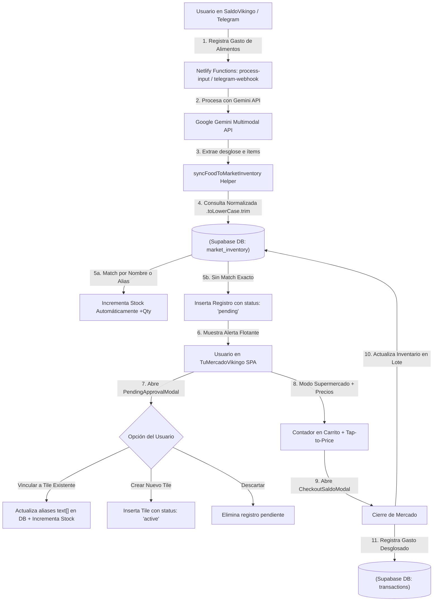

# 🛒 TUMERCADOVIKINGO (`vikingonet-tumercado`) — MANUAL TÉCNICO Y DOCUMENTACIÓN COMPLETA

**TuMercadoVikingo** es una aplicación web *mobile-first* interactiva para la gestión inteligente del inventario de despensa y lista de compras del hogar. Diseñada bajo una estricta filosofía **Zero-Scroll** y una interfaz táctil basada en *tiles* dinámicos en **2 columnas**, la aplicación permite añadir o quitar unidades en tiempo real con un solo tap (+1 / -1) o utilizar el **Modo Supermercado Incremental (Contador de Carrito & Cierre con Integración Contable)**, eliminando por completo la fricción de escribir listas tradicionales.

El proyecto está conectado de forma nativa al mismo backend de **Supabase** que **SaldoVikingo (`vikingonet-saldo-unified`)**, compartiendo la base de datos de usuarios, la sincronización automática de compras de alimentos sin duplicar ítems mediante un sistema de **Asistencia con Confirmación y Aprendizaje de Alias**, y la posibilidad de **registrar el gasto desglosado del mercado directamente en SaldoVikingo** al finalizar las compras.

---

## 📌 1. Resumen Ejecutivo: ¿Qué es, Para qué sirve y Por qué nació?

### ❓ ¿Qué es?
Una SPA (*Single Page Application*) construida en **React + Vite**, optimizada ergonómicamente para teléfonos móviles. Su diseño utiliza la paleta cálida *Light & Warm* (`#FAF7F2` crema/terracota), botones adaptados al pulgar (Thumb-Friendly de 40x40px), respuesta háptica táctil (`useHaptic`), y las tipografías oficiales compartidas con SaldoVikingo: **Outfit** para la interfaz visual y **JetBrains Mono** para cifras numéricas y cantidades.

### 🎯 ¿Para qué sirve?
1. **Control de Stock de Despensa:** Mantiene un registro preciso de los víveres en unidades, kilos, litros o paquetes.
2. **Semáforo Visual de Agotamiento:** Indicadores de estado en cada tile (🟢 Verde = Saludable, 🟡 Amarillo = Cerca de Agotarse, 🔴 Rojo = Agotado).
3. **Lista de Compras Automática (Filtro "Por Comprar"):** Agrupa en 1 tap todo lo que falta por comprar (`quantity <= min_threshold`).
4. **🔍 Búsqueda Rápida Instantánea:** Barra superior para filtrar instantáneamente por texto en nombre, categoría o alias de productos normalizados.
5. **🛒 Modo Supermercado Incremental (Contador de Carrito & Precios al Tap):** Modo interactivo que permite contar artículos agregados al carrito por tile, asignar precios por unidad/total en multi-moneda (`VES`, `USD`, `USDT`, `EUR`) y ver la sumatoria en tiempo real.
6. **💰 Cierre e Integración Directa con SaldoVikingo (`CheckoutSaldoModal`):** Al presionar `✅ Finalizar Mercado`, la app actualiza en lote el inventario y permite guardar el gasto total desglosado directamente en la contabilidad de SaldoVikingo con la tasa del día.
7. **📝 Reporte e Historial de Última Compra (`LastPurchaseModal`):** Genera un resumen tras cada checkout que se almacena en `localStorage` para auditoría o consulta rápida.
8. **📱 Exportación a WhatsApp & Telegram (`shareService.js`):** Formatea la lista en Markdown nativo agrupada por 7 categorías de mercado LatAm y dispara la **Web Share API** nativa (`navigator.share`) en móviles o portapapeles en PC.
9. **✨ Manipulación Total con IA (Google Gemini API):** Modificaciones masivas de inventario ("pon a 0 el mínimo de todos los productos"), análisis de tickets de supermercado con filtrado estricto de víveres y recategorización automática.

---

## 🏗️ 2. Arquitectura del Sistema y Flujos de Integración



---

## 📂 3. Estructura del Workspace (Árbol de Directorios)

```text
vikingonet-tumercado/
├── index.html (Plantilla HTML con importación de Google Fonts: Outfit y JetBrains Mono)
├── package.json (React 19, Vite 8, @supabase/supabase-js, @google/generative-ai, lucide-react)
├── vite.config.js (Configuración con base: '/tumercado/', basicSsl y proxy de funciones)
├── netlify.toml (Mapeo de rutas /tumercado/* y /tumercadovikingo/* hacia SPA)
├── .env.example (Variables de entorno requeridas para Supabase y Gemini API)
├── README.md (Manual técnico y documentación detallada del proyecto)
│
└── src/
    ├── App.css (Estilos específicos del componente principal)
    ├── App.jsx (Componente principal: estado global, Modo Supermercado, Checkout SaldoVikingo, Búsqueda)
    ├── index.css (Sistema de diseño Light & Warm, layout 100dvh Zero-Scroll, 2 columnas y semáforo)
    ├── main.jsx (Punto de entrada de React)
    ├── supabaseClient.js (Inicializador oficial del cliente Supabase con token anónimo)
    │
    ├── components/
    │   ├── BottomToolbar.jsx (Barra inferior del pulgar: Filtro In-App, Exportar, Modo Comprando e IA)
    │   ├── ProductTile.jsx (Tile interactivo: Emoji, Semáforo, botones 40x40px, JetBrains Mono y Checklist)
    │   ├── RenderIconOrEmoji.jsx (Renderizador nativo limpio de Emojis de mercado)
    │   │
    │   └── Modals/
    │       ├── AIQueryModal.jsx (Asistente IA con ejecución de acciones masivas y filtrado de tickets)
    │       ├── CheckoutSaldoModal.jsx (Modal de Cierre de Compra & Integración con SaldoVikingo)
    │       ├── CustomSelectModal.jsx (Modal in-app genérico con creación libre de categorías personalizadas)
    │       ├── DatePickerModal.jsx (Selector emergente in-app de fecha de compra para el registro contable)
    │       ├── EmojiPickerModal.jsx (Catálogo de Emojis con nombres en negrita y animales comestibles)
    │       ├── ItemPriceTapModal.jsx (Modal Tap-to-Price para asignar precios por ítem en multi-moneda)
    │       ├── LastPurchaseModal.jsx (Resumen de la última compra almacenada en localStorage)
    │       ├── ModalInApp.jsx (Patrón base con React Portal createPortal y desenfoque glassmorphism)
    │       ├── PendingApprovalModal.jsx (Bandeja de pendientes con autocompletado y aprendizaje de alias)
    │       ├── ProductEditModal.jsx (Modal de creación/edición con presets de categoría, unidad e incrementos)
    │       └── ShareModal.jsx (Modal de exportación para WhatsApp y Telegram en Markdown)
    │
    ├── constants/
    │   └── categories.js (Definición de categorías de despensa e iconos representativos)
    │
    ├── hooks/
    │   ├── useHaptic.js (Hook de respuesta táctil: navigator.vibrate + CSS scale fallback para iOS/Safari)
    │   └── useInventory.js (Gestión de estado Supabase, debounce y CRUD completo de inventario)
    │
    ├── services/
    │   ├── exchangeService.js (Consulta en vivo de tasas cambiarias oficiales BCV y paralelo P2P/USDT)
    │   └── shareService.js (Clasificador inteligente de mercado y formateador Markdown para WhatsApp/Telegram)
    │
    └── utils/
        └── stringUtils.js (Normalizador de texto: normalizeText sanitiza acentos y minusculas)
```

---

## 🗄️ 4. Modelo de Datos y Esquema Supabase (`market_inventory`)

La tabla `market_inventory` está creada en el esquema `public` de la misma base de datos Supabase de SaldoVikingo:

```sql
-- 🛒 Tabla de Inventario de TuMercadoVikingo (market_inventory)
CREATE TABLE IF NOT EXISTS public.market_inventory (
    id uuid DEFAULT gen_random_uuid() PRIMARY KEY,
    user_id uuid REFERENCES auth.users(id) ON DELETE CASCADE NOT NULL,
    name text NOT NULL,
    aliases text[] DEFAULT '{}'::text[],
    emoji text DEFAULT '🛒',
    category text DEFAULT 'General',
    quantity numeric DEFAULT 0 CHECK (quantity >= 0),
    min_threshold numeric DEFAULT 1,
    unit text DEFAULT 'unid',
    step_increment numeric DEFAULT 1,
    status text DEFAULT 'active' CHECK (status IN ('active', 'pending')),
    raw_source_name text,
    last_purchased_at timestamp with time zone,
    created_at timestamp with time zone DEFAULT timezone('utc'::text, now()) NOT NULL,
    updated_at timestamp with time zone DEFAULT timezone('utc'::text, now()) NOT NULL
);

-- Habilitar Row Level Security (RLS)
ALTER TABLE public.market_inventory ENABLE ROW LEVEL SECURITY;

-- Política de Seguridad por Usuario (RLS)
CREATE POLICY "Usuarios pueden gestionar su propio inventario" ON public.market_inventory
    FOR ALL USING (auth.uid() = user_id);
```

---

## 💡 5. Soluciones Técnicas y Funcionalidades Principales

### 5.1 🛒 Modo Supermercado Incremental & Integración con SaldoVikingo
* **Contador de Carrito por Tile (`shoppingQtyMap`):** Al activar el Modo Comprando, tocar un tile incrementa la cantidad en el carrito según el paso del producto (`step_increment`), permitiendo ajustes dinámicos de +1 / -1 o cantidades decimales en kilos/litros.
* **Tap-to-Price Multi-moneda (`ItemPriceTapModal`):** El usuario puede tocar la caja de precio en cualquier tile del carrito para asignar su costo en `VES`, `USD`, `USDT` o `EUR`.
* **Modal de Cierre de Mercado (`CheckoutSaldoModal`):** Resume todos los productos comprados, calcula el gasto total en Bolívares y Dólares usando `exchangeService.js`, ofrece un selector de fecha personalizado (`DatePickerModal`) y permite registrar con 1 tap la transacción desglosada en la tabla `transactions` de SaldoVikingo bajo la categoría `Alimentos/Automercado`.
* **Historial de Última Compra (`LastPurchaseModal`):** Tras confirmar la compra, guarda el resumen detallado en `localStorage` (`tu_mercado_last_purchase`) y lo presenta en un modal accesible desde la cabecera.

---

### 5.2 🔍 Búsqueda Rápida Instantánea (`searchQuery`)
* Barra de búsqueda ubicada en la cabecera superior de la aplicación.
* Utiliza `normalizeText` de `stringUtils.js` para filtrar en tiempo real eliminando acentos, caracteres especiales y mayúsculas.
* Coincide contra el **nombre del producto**, la **categoría** y el arreglo de **alias asociados** (`aliases`).

---

### 5.3 🚥 Semáforo Visual de Agotamiento
Cada tile en [ProductTile.jsx](file:///z:/REPOS/vikingonet-tumercado/src/components/ProductTile.jsx) calcula su estado de stock e incluye bordes e indicadores tipo badge:
- 🟢 **Verde (`status-healthy`):** `quantity > min_threshold` (Stock Saludable).
- 🟡 **Amarillo (`status-warning`):** `quantity <= min_threshold` y `quantity > 0` (Cerca de Agotarse).
- 🔴 **Rojo (`status-critical`):** `quantity == 0` (Agotado).

---

### 5.4 📱 Exportación a WhatsApp & Telegram (`shareService.js`)
- Clasificación automática e inteligente de productos en 7 categorías de mercado LatAm:
  1. 🥩 **VIANDAS Y PROTEÍNAS**
  2. 🌾 **SECOS Y VÍVERES**
  3. 🥦 **VEGETALES Y FRUTAS**
  4. 🍿 **DULCES, PANADERÍA Y SNACKS**
  5. 🧃 **BEBIDAS Y LÁCTEOS**
  6. 🧼 **LIMPIEZA E HIGIENE**
  7. 📦 **OTROS**
- Generación de texto en Markdown nativo para WhatsApp/Telegram (ej: `• 🍞 *Harina Pan* (Falta: 2 paq)`).
- **Web Share API (`navigator.share`):** Abre la hoja de menú nativa en móviles Android/iOS con WhatsApp y Telegram, con fallback a copia en el portapapeles (`navigator.clipboard`) en PC.

---

### 5.5 ✨ Asistente IA con Ejecución de Acciones Masivas ([AIQueryModal.jsx](file:///z:/REPOS/vikingonet-tumercado/src/components/Modals/AIQueryModal.jsx))
- **Acciones Masivas sobre Supabase:** Soporta órdenes complejas como *"Pon a 0 el mínimo de alerta a todos los productos"*, *"Ajusta el stock de leche a 5"*, *"Recategoriza mis tiles"*, *"Elimina arroz"*.
- **Filtrado Estricto de Tickets:** Al subir fotos o textos de facturas de compras variadas, Gemini filtra e incluye únicamente ítems pertenecientes a la despensa y supermercado, ignorando compras de ferretería, ropa, tecnología, etc.
- **Conocimiento de Categorías Dinámicas:** Gemini conoce en tiempo real la lista viva de categorías personalizadas creadas por el usuario.

---

### 5.6 Catálogo de Emojis de Mercado + Animales Comestibles (`EmojiPickerModal.jsx`)
- Incluye animales comestibles habituales (🐄 Vaca, 🐖 Cerdo, 🐓 Pollo, 🦃 Pavo, 🐑 Cordero, 🐐 Chivo, 🦆 Pato, 🐰 Conejo, 🐟 Pescado, 🦐 Camarón, 🦀 Cangrejo, 🦞 Langosta, 🦑 Calamar, 🦪 Ostra).
- Cada emoji incluye su **etiqueta descriptiva en negrita debajo** (ej. 🐄 **Vaca / Res**, 🍞 **Pan**, 🧀 **Queso**).

---

### 5.7 Layout 100dvh Zero-Scroll y 2 Columnas Estrictas
- Se impuso `height: 100dvh`, `position: fixed; inset: 0;` y `overflow-x: hidden` en `html`, `body` y `.app-container`.
- Se fijó la cuadrícula `.tiles-grid` en **2 columnas amplias (`grid-template-columns: repeat(2, 1fr)`)** dentro del contenedor de 480px, eliminando cualquier desbordamiento o scroll lateral.

---

### 5.8 🌐 Ruteo, Base Path y Proxy Inverso (`vikingonetworks`)
- **Base Path en Vite:** `vite.config.js` define `base: '/tumercado/'`. Esto garantiza que los bundles estáticos (CSS, JS) generados por Vite se soliciten bajo el prefijo `/tumercado/assets/...`.
- **Integración con Router Principal (`vikingonet.com`):** El repositorio orquestador `vikingonetworks` redirige las peticiones entrantes:
  - `/tumercadovikingo/*` ➔ `https://vikingo-tumercado.netlify.app/tumercadovikingo/:splat`
  - `/tumercado/*` ➔ `https://vikingo-tumercado.netlify.app/tumercado/:splat`
- **Reescrutura Interna en Netlify:** En `netlify.toml` de `vikingonet-tumercado`, las rutas `/tumercadovikingo/*` y `/tumercado/*` se reescriben a `/:splat` internamente, permitiendo servir la SPA tanto en acceso directo como bajo el dominio unificado `vikingonet.com/tumercado`.

---

## 🚀 6. Guía de Instalación y Ejecución Local

### 1. Variables de Entorno (`.env`)
```env
VITE_SALDO_SUPABASE_URL=https://tu-proyecto.supabase.co
VITE_SALDO_SUPABASE_ANON_KEY=tu-anon-key-de-supabase
VITE_SALDO_GEMINI_API_KEY=tu-api-key-de-gemini
```

### 2. Comandos
```bash
# Instalación de dependencias
npm install

# Servidor local de desarrollo (HTTPS SSL)
npm run dev

# Compilación para producción
npm run build
```

---

## 👨‍💻 Créditos
Desarrollado y mantenido por el equipo de **VikingoNet** como parte del ecosistema digital **SaldoVikingo**.
